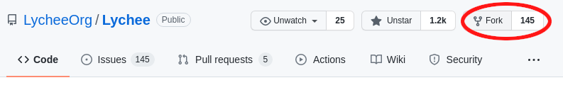
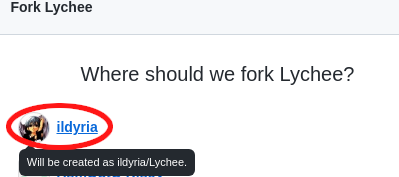
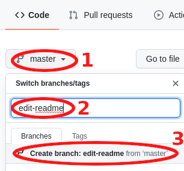
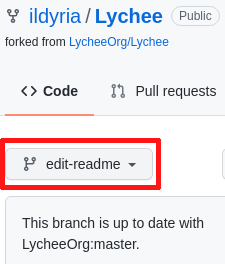
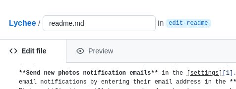
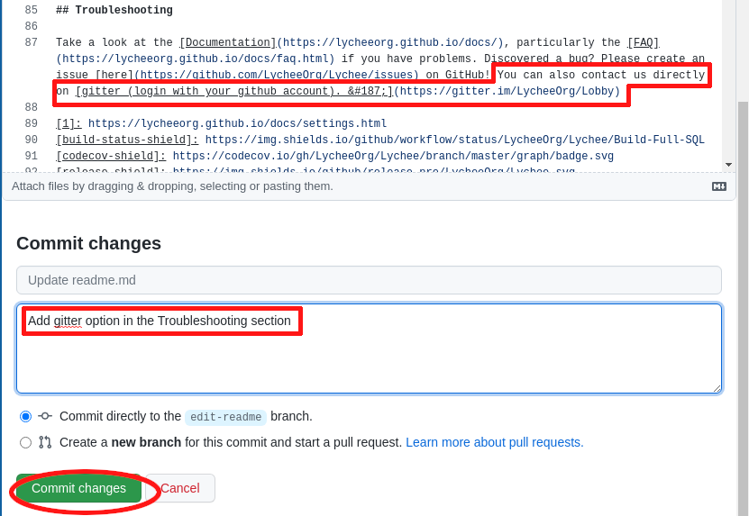
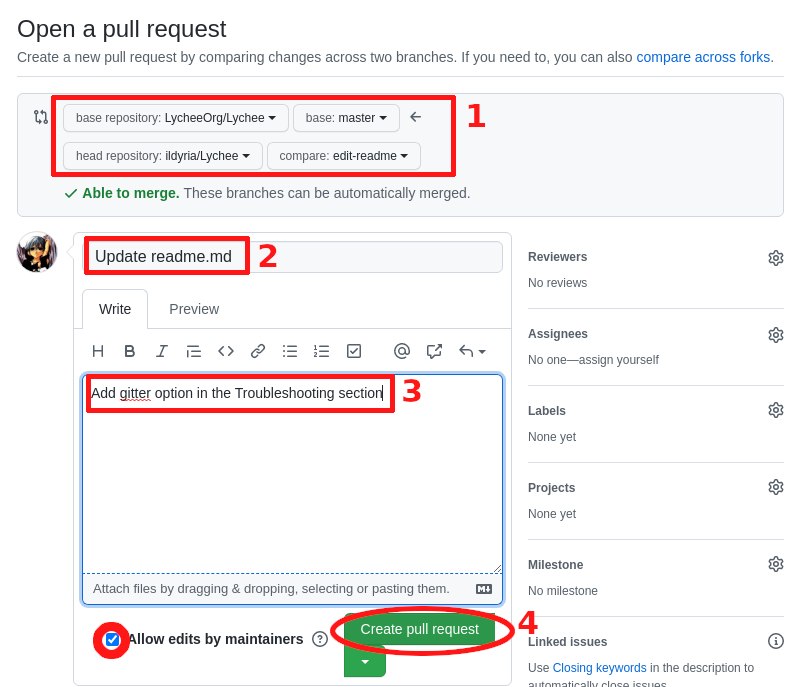

## Bug Reports

To encourage active collaboration, Lychee strongly encourages pull requests, not just bug reports. "Bug reports" may also be sent in the form of a pull request containing a failing test.

However, if you file a bug report, your issue should contain a title and a clear description of the issue. You should also include as much relevant information as possible to demonstrate the issue. We provide a template and expect it to be respected. Most bug reports that do not follow it will likely be closed. The goal of a bug report is to make it easy for yourself &mdash;and others&mdash; to replicate the bug and develop a fix.

Remember, bug reports are created in the hope that others with the same problem will be able to collaborate with you on solving it. Do not expect that the bug report will automatically see any activity or that others will jump in to fix it. Creating a bug report serves to help yourself and others start on the path to fixing the problem. If you want to chip in, you can help out by fixing any bugs listed in our [issue trackers][1].

## Support Questions

Lychee's GitHub issue trackers are not intended to provide Lychee help or support. Please instead create a discussion [here][3] or contact us directly on [discord][2].

## Security Vulnerabilities

Lychee uses a rolling release system, **we do not backport fixes to previously released versions**.
Those are the versions in which we accept vulnerability reports.

| Version        | Supported |
|----------------|-----------|
| master         | &#10004;  |
| latest release | &#10004;  |
| < 6.0          | &#10005;  |

If you discover a security vulnerability within Lychee, please contact us directly on [Discord][2]. All security vulnerabilities will be promptly addressed.

## Core Development Discussion

You may propose new features or improvements to existing Lychee behavior in the [issue board][1]. If you propose a new feature, please be willing to implement at least some of the code that would be needed to complete the feature.

## Joining the Team

You would like to support Lychee and help us push it further? Join the team!
Your passion for Lychee will be measured by how active you are on the project.
We are looking for people who are willing to help us maintain the project,
review pull requests, and fix bugs.

If you would like to just do code review, that's fine too!
We are always looking for more eyes on the code to ensure its quality.
We will need your github handle to add you to the reviewer team.

Contact us on [Discord][2]  if you would like to know more! :)

## How to properly submit a pull-request to Lychee?

Pull requests need to respect a few simple constraints described below, which make everyone's life easier.

### Which Branch to use?
When submitting a new feature or fixing a bug, please create a new branch from master:

```bash
git checkout master
git pull master
git checkout -b <fix-issue-number>
```

Modify the desired files.

```bash
git add <files-you-modified>
git commit -m "<mesage-of-what-is-going-on>"
git push -u
```

You can then open a [pull request][4].

### Our Coding Style
In order to ease the review of pull requests, we use a uniform code style. Our Continuous Integration suite will 
fail if the latter is not respected.

#### PHP

Our coding style is defined by the `.php-ps` file; it is mostly the Symfony style, but we use tabs instead of spaces.

Before submitting a PR, we highly encourage you to do the following:
```bash
./vendor/bin/php-cs-fixer fix -v --config=.php-cs-fixer.php
# or
make formatting
```
This will ensure that the code is consistent with our style.

In order to make this less constraining, you can copy the `pre-commit` file in the root into the `.git/hooks` folder. This will execute the fixer to maintain consistency.

Our current configuration can be found [here](https://github.com/LycheeOrg/Lychee/blob/master/.php_cs).
For details about the options, you can have a look at the [php-cs-fixer-configurator](https://mlocati.github.io/php-cs-fixer-configurator)

#### Javascript/TypeScript

Similarly to what was described above, you can format the code automatically with:

```bash
npm run format
```

### PHPDoc
Below is an example of a valid Laravel documentation block. Note that the @param attribute is followed by two spaces, the argument type, two more spaces, and finally the variable name:

```php
/**
 * Register a binding with the container.
 *
 * @param  string|array  $abstract
 * @param  \Closure|string|null  $concrete
 * @param  bool  $shared
 * @return void
 *
 * @throws \Exception
 */
public function bind($abstract, $concrete = null, $shared = false)
{
    //
}
```

In addition to code documentation, we highly encourage you to use the types system of PHP for the function arguments.
This will increase the trust and safety of the code.

### Illustrated example

As follows, we present a simple pull request modifying the `readme.md`.

<ol>
<li>Fork the repository.

<p></p>
</li>

<li>Select your own account as the destination of the fork.

<p></p>
</li>

<li>Create a new branch.

<ol style="margin-left:1em">
<li>Click on the drop down menu.</li>
<li>Enter the name of the new branch.</li>
<li>Click <strong>Create branch:...</strong>.</li>
</ol>

<p></p>
</li>

<li>Make sure the new branch is selected.

<p></p>
</li>

<li>Edit the desired files.

<p></p>
</li>

<li>Commit the changes.

If possible, provide a summary of the changes done by the commit in the description before clicking <strong>Commit changes</strong>

<p></p>
</li>

<li>Create a new pull request.

<p></p>
</li>

<li>Fill in and submit the pull request.

<ol style="margin-left:1em">
<li>Make sure that the base repository is the one from <code>LycheeOrg</code> on the branch <code>master</code>.</li>
<li>Provide a good title to the changes you would like to be applied.</li>
<li>Add a description of the changes, motivations, what is being done etc. Also make sure that <strong>Allow edit by the maintainers is being checked</strong>This will allow us to fix the pull request if necessary.</li>
<li>Submit the pull request.</li>
</ol>

<p></p>
</li>

<li>Wait for the team to get back at you and review the PR.</li>

</ol>

## Code of Conduct
The Lychee code of conduct is the same as Laravel's code of conduct:

- Participants will be tolerant of opposing views.
- Participants must ensure that their language and actions are free of personal attacks and disparaging personal remarks.
- When interpreting the words and actions of others, participants should always assume good intentions.
- Behavior that can be reasonably considered harassment will not be tolerated.


[1]: https://github.com/LycheeOrg/Lychee/issues
[2]: https://discord.gg/JMPvuRQcTf
[3]: https://github.com/LycheeOrg/Lychee/discussions
[4]: https://github.com/LycheeOrg/Lychee/pulls

