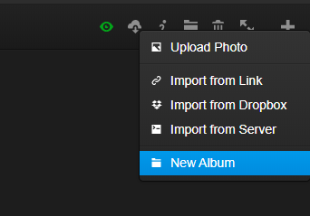

## General questions

### Which browsers are supported?

Lychee should work with any modern, standards-compliant web browser (note that having JavaScript enabled is a hard dependency). Lychee does take advantage of several HTML5 features, such as the `<video>` tag, responsive image sizing using `srcset`, or link data prefetching. In particular, Lychee supports the latest versions of Google Chrome, Apple's Safari, Mozilla Firefox, Opera, and Microsoft Internet Explorer.

If you experience any issues with Lychee and wish to report it, make sure to specify the browser you're using and the version of it.

### Which file formats are supported?

Lychee supports major image formats, and since version 3.2.1 some video formats as well. Specifically, `*.jpg`, `*.jpeg`, `*.png`, `*.gif`, `*.webp`, `*.ogv`, `*.mp4`, `*.mpg`, `*.webm`, `*.mov`, `*.m4v`, `*.avi` and `*.wmv` are accepted.

If you're uploading video files, make sure to increase your upload limits in `php.ini`.  See the [Installation](installation.html) section for more information.

### What is new?

Take a look at the [Release Notes](releases.html) to see what's new.

### How can I easily contact the LycheeOrg organization?

There is a Gitter associated with the project, feel free to join us there: https://gitter.im/LycheeOrg/Lobby

### How can I set thumbnails for my albums?

Thumbnails are selected automatically from the photos inside the album (and any subalbums) based on the photo sorting order specified in the [Settings](settings.html#sorting). _Precedence is given to starred photos_. In practical terms, if only one photo inside an album is starred, that photo is guaranteed to be the top thumbnail.

### Is it possible to create folders inside another folder? If so, how to do that?

Either press `n` (as **N**ew) or use the add menu.



### What headers need to be used to authenticate with the custom `api_key` in the settings?

In order to bypass the CSRF protection, you can set up the `api_key` setting to a secret value and send that value over in the `Authorization` header.  
Note that `api_key` only disables the CSRF protection, you still need to authenticate to the server.

In order to authenticate, use [Session::login](https://lycheeorg.github.io/docs/api.html#apisessionlogin) and pass the returned `lychee_session` cookie to all subsequent requests.

The related code is available [here](https://github.com/LycheeOrg/Lychee/blob/master/app/Http/Middleware/VerifyCsrfToken.php#L55)

### Can I use my existing folder structure?

Not at this time. Lychee currently uses its own folder structure and database. Please upload or import all your photos to use them.

### Can I upload videos?

Yes, but you may need to change this property to a bigger value:
```ini
upload_max_filesize = 100M
```
### Is it possible to create multiple users?

Yes. Just go to the `Users` menu.

### Does Lychee use ImageMagick?

Yes. Lychee uses ImageMagick when available.

### How to change the title of the site?

Go to the advanced Settings menu and change the value of `site_title`.

### How to reset username and password?

Via SSH, use the command `php artisan lychee:reset_admin`.

### How to hide smart albums?

Add the following custom CSS to your `user.css` or via the settings menu:
```css
[data-id="unsorted"] { display:none; }
[data-id="public"] { display:none; }
[data-id="starred"] { display:none; }
[data-id="recent"] { display:none; }
div.content > div.divider:first-child { display:none; }
div.content > div.divider:nth-child(6) {
    margin-top: 10px;
    border-top: 0;
    box-shadow: none;
}
```

### How to disable the 'zoom' animation while browsing pictures?

Add the following custom CSS to your `user.css` or via the settings menu:
```css
#imageview #image {
  transition: none !important;
  animation-name: none !important;
  animation-duration: 0 !important;
}
```

### How is the upload folder protected?

From [#304](https://github.com/LycheeOrg/Lychee/issues/304)

Short version: It's not protected

Long answer: [#295](https://github.com/LycheeOrg/Lychee/pull/295) added some protection through symlinking, so that the URLs used are temporary.

Right now, the protection is basically through the use of difficult to guess names (it's an MD5 checksum of the system time at the time of upload). [#295](https://github.com/LycheeOrg/Lychee/pull/295) not only made those names temporary (this needs to be enabled in the Settings, BTW) but it also provided optional support for hiding the full-size version (this is only effective with symlinking as without it the URL can be derived from that of intermediate-size images).

[@ildyria](https://github.com/ildyria) recently posted the following link on how a more effective protection could be implemented: https://bedigit.com/blog/laravel-5-how-to-access-image-uploaded-in-storage-within-view/. He didn't go down that route himself due to performance concerns but I agree that if somebody contributed a clean implementation as an option, we'd probably accept it.

### My login is timing out after two hours, how can this be changed?

You can edit your `.env` and modify the `SESSION_LIFETIME=120` part (in minutes).

### How can I clear the Logs? 

To remove the `Notice` and `Warnings`, simply click on the button at the top of the Log page.
However if the page is too heavy to load, you can either manually empty the `Logs` table or use artisan:

```bash
cd Lychee
php artisan lychee:logs clean
```

### How can I see the correct client IP address when running Lychee behind Cloudflare?]

Please see [https://github.com/monicahq/laravel-cloudflare](https://github.com/monicahq/laravel-cloudflare). The Lychee file that needs changing can be found [here](https://github.com/LycheeOrg/Lychee/blob/master/app/Http/Middleware/TrustProxies.php).

### Can I set up Lychee to watch a folder for new images and automatically add them to albums?

Lychee can import photos from the command line using `php artisan lychee:sync /path/to/import`. Folders in this path will be converted to albums, and subfolders as subalbums using `php artisan lychee:sync /path/to/import --album_id="album ID"`.


This command can be scheduled using `cron` or a systemd timer.
```bash
man crontab
man systemd.timer
```


### Special right-click menu doesn't appear for new users?

For example:  


No this is normal. This user does not have the ownership of that Album, so the right click is not available. You can see _sharing_ as a _read_ permission.

> Also, the divider h1 shows the text "Admin" when logged in with an ordinary user. I guess this should be "Albums"?

Actually no, this is because the user does not have any albums (yet). The `h1` divider is to show who is the owner of those albums. See bellow.

And yes the right-click menu is available on the _PhD Defenses_ part but not in the _Admin_ parts.
Also because this user has upload right, he can see the _Unsorted, Public, Starred, Recent_ smart albums. 


## Installation, migration, upgrade, update


### How can I install Lychee without SSH access?

1. Download the latest release
2. Extract and upload the folder via FTP
3. access the website
If you are at the wrong address you will be told to go to the `public` folder.
Once open, you will be redirected to the install procedure. Completed you will be able to create an admin account and enjoy Lychee.

### How do I upgrade from Lychee v3 to Lychee v4?

The process is described [here](upgrade.html).

### How can I back up my installation?

To back up your Lychee installation you need to perform the following steps:

1. Create a copy of at least the following parts of the Lychee directory tree (e.g., `/var/www/html/Lychee`):
```
.env
public/dist/user.css
public/uploads/
```
2. Dump the Lychee database to a file. E.g., if you are using MySQL, run:
```bash
mysqldump -u user -ppassword --databases lychee_database > lychee_backup.sql
```
Replace `user`, `password`, and `lychee_database` by the values of `DB_USERNAME`, `DB_PASSWORD`, and `DB_DATABASE` from the `.env` file in the Lychee folder.

### How can I migrate my installation to a new host?

Back up your installation as describe above and:

<ol start="3">
<li>Download the latest release of Lychee.</li>
<li>Overwrite the files with your back up</li>
<li>
Restore the database on the new host, e.g., for MySQL:
<p><code class="language-bash">mysql -u user -ppassword < lychee_backup.sql</code></p>
</li>
</ol>

### Can I host Lychee with a subpath with Nginx? Like `https://example.dev/lychee/`

Yes, here is a configuration to help you:

```nginx
location ^~ /lychee {
    alias /var/www/lychee/public;
    index index.php;
    try_files $uri $uri/ @lychee;
    location ~ \.php$ {
        if (!-e $request_filename) {
            rewrite ^/lychee/?(.*)$ /lychee/index.php?/$1 last;
            break;
        }
        fastcgi_pass unix:/var/run/php/php7.4-fpm.sock;
        fastcgi_index index.php;
        include fastcgi_params;
        fastcgi_param SCRIPT_FILENAME $request_filename;
    }
}
location @lychee {
    rewrite /lychee/(.*)$ /lychee/index.php?/$1 last;
}
```

### Can I host Lychee with a subpath with Apache? Like `https://example.dev/lychee/`

Yes, just create a Symbolic Link and allow your apache configuration to follow them.
At website.com root `ln -s Lychee/public pics` and you will get exactly what you want: `website.com/pics`

### Do we really need writable `app/`?

From [#311](https://github.com/LycheeOrg/Lychee/issues/311)

Short answer: Lychee will work without a writable `app/` folder.

However, if you want to be able to update your Lychee installation with a click of a button in the web browser (though it's disabled by default), your whole Lychee installation tree (and not just `app/`) must be http-writable.

As far as I know, the minimum set of directories that need to be http-writable is as follows:
```
storage/
storage/
storage/
public/uploads/small
public/uploads/big
public/uploads/thumb
public/uploads/medium
public/uploads/import
public/dist
```

### Is it possible to do the update directly from the GUI? How?

You go to `Diagnostics` &Rarr; `Check for Updates`  
Once done you need to update the `Diagnostic` page (click on it again in the left menu) 
You will see a `Apply Update` button on the top. Click on it and done.
If it breaks (error 500) you can still go back to command line and do your `git pull`, migrate etc...

There are some securities that you need to disable via the advanced settings menu:

- you need to allow update if your `.env` specify `production`:  
  `force_migration_in_production = 1`
- you need to allow composer :  
  `apply_composer_update = 1` (optional)

The second one is really optional if updates don't need the composer (like 90% of the time) then it can just stay at `0`.

### Can I migrate from a 64-bit system to a 32-bit system?

Yes, but it's not trivial or recommended. After copying the database:
1. Download [this](https://github.com/LycheeOrg/Lychee/raw/54d00878949906c2efd4f6ddd9e79669637c58fb/database/migrations/2019_04_07_193345_fix_32bit.php) file to your `database/migrations/` folder.
2. Run  the SQL command `delete from migrations where migration='2019_04_07_193345_fix_32bit';` to make sure it will run.
3. Run `php artisan migrate`. This should run a one-off migration that was originally added to allow 32-bit systems to migrate from Lychee v3.

This will only work on top-level albums. Subalbums will require [manual intervention](https://github.com/LycheeOrg/Lychee/issues/406#issuecomment-571378073).

### Why can't I see the *check for update* button in the GUI?

- Make sure you are using a `git` installation and not a downloaded release
- Make sure you are on the `master` branch
- Make sure your web user has read and write access to `.git`
- Check that `exec` is available.
- Check that `allow_online_git_pull` setting is set to `1`

### How can I stop `artisan migrate` and `composer` from running after every `git pull`?

We've set composer to install git `pre-commit` and `post-merge` hooks by default.
- The pre-commit is to help developers by checking and fixing and code style problems before they hit our testing. If you aren't committing and changes, this will not be run.
- The post-merge ensures that your dependencies and database version are kept current. This can be disabled by creating a file `.NO_AUTO_COMPOSER_MIGRATE` in your Lychee root and deleting (if necessary) `.git/hooks/post-merge`. If you disable this script, you will need to run `composer` and `artisan migrate` manually. Alternatively, the Update UI can be set to handle this if you run your updates there.


## Problems

### Lychee is not working

If Lychee is not working properly, try to open `https://lychee.example.com/Diagnostics`. This script will display all errors it can find.

Another way to see this screen is to use the command: `php artisan lychee:diagnostics`

### When I do X, I get an error API not found, what can I do?

Open the dev modules of your browser (usually by pressing `F12`) and open the Network tab.
Redo the action with Network tab open and look at the response of the last query (most likely a red line).
If it is an error 404 or 500, see below, otherwise look at our [issues](https://github.com/LycheeOrg/Lychee/issues) (including the closed ones).
If nothing helps, don't hesitate to open a new one.

### I have an error 404 and I'm using Apache, what can I do?

Verify that the rewrite rules of your server are correctly applied. See [here](upgrade.html#using-apache).

### I have an error 404 and I'm using Nginx, what can I do?

Verify that the rewrite rules of your server are correctly applied. See [here](upgrade.html#using-nginx).

### I have an error 404 and I'm using php -S, what can I do?

Instead of doing `php -S 127.0.0.1:8888` inside `Lychee/public` do `php artisan serve --port=8888` inside Lychee.
This will ensure that the paths and routes are correctly followed.

> {note} Note that the `serve` command should only be used for testing and debuging. It should not be used on a production server.

### I have an error 500, what can I do?

Edit the `.env` file and set `APP_DEBUG` to `true`, this will allow the errors to be displayed with the trace.

### I have an errror 419 in the Network tab, what is going on?

Verify that your `SESSION_DRIVER` is not `array`. With `array`, the data is stored a non-persisting PHP array, it is only meant for testing !
More [here](https://laracasts.com/discuss/channels/general-discussion/how-does-cache-driver-array-work).  
Prefer `file` or `database` (but that last one require some [more configuration](https://laravel.com/docs/7.x/session#driver-prerequisites))

> {note} `php -S` web server was designed to aid application development. It may also be useful for testing purposes or for application demonstrations that are run in controlled environments. It is not intended to be a full-featured web server. It should not be used on a public network.

### I can't upload (large) photos.

Issues may occur when trying to upload photos with large **file sizes** or large **resolutions**.

If you experience problems uploading photos with large **file sizes**, you might want to change the PHP parameters in `.htaccess` (if you are using the PHP Apache module) or in `.user.ini` (if you are using PHP with CGI or FastCGI).

> If you modify the `.user.ini` file, you may want to run `git update-index --assume-unchanged .user.ini` afterwards.

If possible, change these settings directly in your `php.ini`. We recommend to increase the values of the following properties:

```ini
max_execution_time = 200
post_max_size = 100M
upload_max_size = 100M
upload_max_filesize = 100M
memory_limit = 256M
```

Also check the settings for your web server (e.g. `client_max_body_size` in nginx) allow for large uploads.

If problems occur when uploading photos with large **resolutions**, the issue may lie with **ImageMagick Security Policy**.
Review and edit the options in `/etc/ImageMagick-6/policy.xml`.
Editing the `width`, `height` and `memory` options can help with enabling upload of images with larger resolutions.

For more information, see [here](https://legacy.imagemagick.org/script/security-policy.php) for ImageMagick 6 and [here](https://imagemagick.org/script/security-policy.php) for ImageMagick 7.

### What does _Upstream sent too big header_ error message mean?

This error may be seen from your browser's console if you're trying to debug something with Lychee. If using `nginx`, try adding the following to Lychee's config and reload nginx's service:
```nginx
fastcgi_buffers 16 16k;
fastcgi_buffer_size 32k;
```

### Why don't my videos have thumbnails?

You will need ffmpeg installed on your server, and to have installed php-ffmpeg using composer as detailed in the [Installation Guide](installation.html).

Once this is taken care of, check that the
[`has_ffmpeg` setting](settings.html) is set to `1`.  Lychee can reset it
to `0` if it can't find the binaries the first time it tries.  The Lychee
log will contain a `Failed to extract snapshot: bad config` notice if that
is the case.

If that doesn't help, check if metadata is extracted correctly from the
video files.  While viewing a video file in Lychee, simply open the info
sidebar (_i_) and check if the resolution, duration, and frame rate are
reported correctly.  If they are not, you may need to let the metadata
extractor know the location of your `ffprobe` binary.  The Lychee log will
contain a `Given path () to the ffprobe binary is invalid` error if this is
the issue.

Edit the file
`Lychee/vendor/lychee-org/php-exif/lib/PHPExif/Adapter/FFprobe.php`,
replacing the line:
```php
protected $toolPath;
```
(here's a
[sample location](https://github.com/LycheeOrg/php-exif/blob/1ea3468d4ea6a5cf0ea6c748a3a2376de38bbbfd/lib/PHPExif/Adapter/FFprobe.php#L36))
with:
```php
protected $toolPath = '/usr/bin/ffprobe';
```
using your correct binary location. If unsure, you can try running
`which ffprobe` on the server.

This will likely need to be repeated for the video frame extraction code;
otherwise, you will see in the Lychee log an `Unable to load FFProbe` error.
To fix that, in Lychee versions prior to 4.2.0, edit the file
`Lychee/app/ModelFunctions/PhotoFunctions.php`, replacing the line:
```php
$ffmpeg = FFMpeg\FFMpeg::create();
```
(here's the
[location for version 4.1.0](https://github.com/LycheeOrg/Lychee/blob/v4.1.0/app/ModelFunctions/PhotoFunctions.php#L566))
with:
```php
$ffmpeg = FFMpeg\FFMpeg::create(array(
        'ffmpeg.binaries'  => '/usr/bin/ffmpeg',
        'ffprobe.binaries' => '/usr/bin/ffprobe',
));
```
again, using your correct binary locations.

Starting with version 4.2.0, the file to edit is instead `Lychee/app/Actions/Photo/Extensions/VideoEditing.php`; replace the line:
```php
$ffmpeg = FFMpeg::create();
```
(here's a
[sample location](https://github.com/LycheeOrg/Lychee/blob/23731e104737175f51a9acef199bf7d8829e5d5c/app/Actions/Photo/Extensions/VideoEditing.php#L48))
with:
```php
$ffmpeg = FFMpeg::create(array(
        'ffmpeg.binaries'  => '/usr/bin/ffmpeg',
        'ffprobe.binaries' => '/usr/bin/ffprobe',
));
```

### Composer can't create a cache directory

* When running Composer, you may notice the following warning:
```
Cannot create cache directory /home/$USER/.composer/cache/files/, or directory is not writable. Proceeding without cache
```
* You can specify Composer's cache directory with the environment variable `COMPOSER_CACHE_DIR=`. For Lychee, the cache is not necessary, and you can both disable it and hide the warning by specifying the location of the cache as `/dev/null` ([information](https://github.com/composer/composer/commit/fd6455218e304e9b484bebb0efcdb67bb52d051d)):
```bash
COMPOSER_CACHE_DIR='/dev/null' composer update --working-dir='/var/www/Lychee'
```

### I can't access the users under settings server error or api not found on Lightspeed

If you receive a server error or "api not found" error under lightspeed web server try going to `cPanel` > `Mod Security` and turning the feature off.

### I know my file permissions for `storage`, `bootstrap/cache`, `public/uploads`, and `public/dist` are correct and accessible by my web server user, but I'm still getting a PHP error when writing to any of these directories.

1. Make sure your PHP user and group is the same user and group as your web server by editing PHP's `www.conf`. For example, on a Fedora 32 Server system, the default user/group for php from Fedora's standard repo defaults to `apache`, even if you do not have Apache installed. 
2. On some operating systems with more restrictive SELinux rules (like Fedora 32 Server at the time of writing), you need to set the SELinux security context of these directories for them to be accessible by your web server user: 
```bash
chcon -R -t httpd_sys_rw_content_t storage
chcon -R -t httpd_sys_rw_content_t bootstrap/cache
chcon -R -t httpd_sys_rw_content_t public/uploads
chcon -R -t httpd_sys_rw_content_t public/dist
```

### I know port 80/443 are open on my machine, but Lychee/my server is still refusing all connections.

On some operating systems with more restrictive SELinux rules (like Fedora 32 Server at the time of writing), you need to allow your web server user to connect over the network with `setsebool -P httpd_can_network_connect on`. You can view the status of your SELinux booleans with `getsebool -a`.

### I know my SQL database is setup correctly, but Lychee is showing `SQLSTATE[HY000] [2002] No such file or directory` and is not able to make changes to the database. 

In `/var/www/html/Lychee/.env`, change `DB_HOST=localhost` to `DB_HOST=127.0.0.1`. Additionally, if `DB_PORT=` is not set, it should be set to `DB_PORT=3306` for mysql/MariaDB's default port, or whatever custom port you selected when configuring your SQL server software after installation. 

### Why are there messages about git files in my logs? (e.g. `.git/HEAD: failed to open stream: No such file or directory`)

Lychee checks for the presence of certain files to detect whether Lychee was installed as a git repository or from a release archive (.zip). It also uses them to determine which git commit is in use where applicable. This is included in the Diagnostics page to assist us in diagnosing issues.

These messages can be safely ignored.
