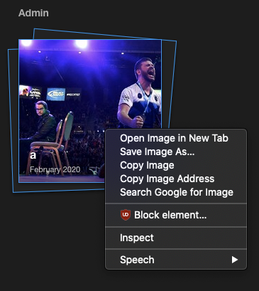

### Which browsers are supported?

Lychee should work with any modern, standards-compliant web browser (note that having JavaScript enabled is a hard dependency). Lychee does take advantage of several HTML5 features, such as the `<video>` tag, responsive image sizing using `srcset`, or link data prefetching. In particular, Lychee supports the latest versions of Google Chrome, Apple's Safari, Mozilla Firefox, Opera, and Microsoft Internet Explorer.

If you experience any issues with Lychee and wish to report it, make sure to specify the browser you're using and the version of it.

### Which file formats are supported?

Lychee supports major image formats, and since version 3.2.1 some video formats as well. Specifically, `*.jpg`, `*.jpeg`, `*.png`, `*.gif`, `*.webp`, `*.ogv`, `*.mp4`, `*.mpg`, `*.webm`, `*.mov`, `*.m4v`, `*.avi` and `*.wmv` are accepted.

If you're uploading video files, make sure to increase your upload limits in `php.ini`.  See the [Installation](installation.html) section for more information.

### What is new?

Take a look at the [Release Notes](releases.html) to see what's new.

### How can I easily contact the LycheeOrg organization?

There is a Gitter associated with the project, feel free to join us there: https://gitter.im/LycheeOrg/Lobby

### How can I set thumbnails for my albums?

Thumbnails are selected automatically from the photos inside the album (and any subalbums) based on the photo sorting order specified in the [Settings](settings.html#sorting). _Precedence is given to starred photos_. In practical terms, if only one photo inside an album is starred, that photo is guaranteed to be the top thumbnail.

### Is it possible to create folders inside another folder? If so, how to do that?

Either press `n` (as **N**ew) or use the add menu.


### What headers need to be used to authenticate with the custom `api_key` in the settings?

In order to bypass the CSRF protection, you can set up the `api_key` setting to a secret value and send that value over in the `Authorization` header.  
Note that `api_key` only disables the CSRF protection, you still need to authenticate to the server.

In order to authenticate, use [Session::login](https://lycheeorg.github.io/docs/api.html#apisessionlogin) and pass the returned `lychee_session` cookie to all subsequent requests.

The related code is available [here](https://github.com/LycheeOrg/Lychee/blob/master/app/Http/Middleware/VerifyCsrfToken.php#L55)

### Can I use my existing folder structure?

Not at this time. Lychee currently uses its own folder structure and database. Please upload or import all your photos to use them.

### Can I upload videos?

Yes, but you may need to change this property to a bigger value:
```ini
upload_max_filesize = 100M
```

### Is it possible to create multiple users?

Yes. Just go to the `Users` menu.

### Does Lychee use ImageMagick?

Yes. Lychee uses ImageMagick when available.

### How to change the title of the site?

Go to the advanced Settings menu and change the value of `site_title`.

### How to reset username and password?

Via SSH, use the command `php artisan lychee:reset_admin`.

### How to hide smart albums?

Go into your _Settings_ then _More_, find `SA_enabled` in the _"Smart Albums"_ section and set it to `0`.

### How to disable the 'zoom' animation while browsing pictures?

Add the following custom CSS to your `user.css` or via the settings menu:
```css
#imageview #image {
  transition: none !important;
  animation-name: none !important;
  animation-duration: 0 !important;
}
```

### How to use a custom font on the landing page?

In order to use a specific font on the landing page which does not rely on some font provided by the client-side browser, you have two options:

1. self-host the necessary set of font files as part of your Lychee installation
2. use an external font-hosting service such as Google Fonts

Both options require to tweak the custom `user.css` via the settings menu.

#### Option 1: Self-hosted font files

Let's assume that your favorite font is called `My Font`. You need a set of the font files in WOFF2 format with one font file per used font weight and style. The landing page uses 5 different font weights (200 = thin, 300 = light, 400 = normal, 500 = thick, 700 = bold) all in normal (i.e. upright) style.

The necessary CSS consists of two parts: firstly, the font face and its different weights are declared via the `@font-face`-directive; secondly, the declared font needs to be used by the styles for the page. A template CSS code for `user.css` looks like this.

```css
@font-face {
    font-family: "My Font";
    font-style: normal;
    font-weight: 200;
    src: local(""), url("<font URL for weight 200>") format("woff2");
}
@font-face {
    font-family: "My Font";
    font-style: normal;
    font-weight: 300;
    src: local(""), url("<font URL for weight 300>") format("woff2");
}
@font-face {
    font-family: "My Font";
    font-style: normal;
    font-weight: 400;
    src: local(""), url("<font URL for weight 400>") format("woff2");
}
@font-face {
    font-family: "My Font";
    font-style: normal;
    font-weight: 500;
    src: local(""), url("<font URL for weight 500>") format("woff2");
}
@font-face {
    font-family: "My Font";
    font-style: normal;
    font-weight: 700;
    src: local(""), url("<font URL for weight 700>") format("woff2");
}

#logo h1 span,
#logo h1,
#intro,
.menu .menu-item {
    font-family: "My Font", sans-serif !important;
}
```

#### Option 2: Using an external font-hosting service

If you want to use an external font-hosting service, replace the `@font-face` blocks of the template above with an `@import`-directive which points to the externally hosted font. The name of the font-family must be replaced by the font name as documented by the external font-service.
For example, let's assume you want use Google's Nunito font. Then the CSS has to look like

```css
@import url("https://fonts.googleapis.com/css?family=Nunito:200,300,400,500,700");
#logo h1 span,
#logo h1,
#intro,
.menu .menu-item {
    font-family: "Nunito", sans-serif !important;
}
```

You also have to change the CSP (Content Security Policy) to allow loading fonts from the external server. Therefore, add the following to the `csp` array in `config/secure-headers.php` (for example, below the `sandbox` line, one of the last lines in this file):

```php
		'style-src' => [
			'allow' => [
				'https://fonts.googleapis.com',
			],
			'nonces' => [],
			'self' => true,
			'unsafe-inline' => true,
			'report-sample' => true,
			'add-generated-nonce' => false,
		],
		'font-src' => [
			'allow' => [
				'https://fonts.gstatic.com',
			],
			'self' => true,
		],
```

Change the URLs `https://fonts.googleapis.com` and `https://fonts.gstatic.com` to match your provider's URLs.

### How to add custom scripts?

Edit the `custom.js` file in `/path/to/lychee/public/dist/` or use the _"Personalize JS"_ area in _Settings_.

### How is the upload folder protected?

From [#304](https://github.com/LycheeOrg/Lychee/issues/304)

Short version: It's not protected

Long answer: [#295](https://github.com/LycheeOrg/Lychee/pull/295) added some protection through symlinking, so that the URLs used are temporary.

Right now, the protection is basically through the use of difficult to guess names (it's an MD5 checksum of the system time at the time of upload). [#295](https://github.com/LycheeOrg/Lychee/pull/295) not only made those names temporary (this needs to be enabled in the Settings, BTW) but it also provided optional support for hiding the full-size version (this is only effective with symlinking as without it the URL can be derived from that of intermediate-size images).

[@ildyria](https://github.com/ildyria) recently posted the following link on how a more effective protection could be implemented: https://bedigit.com/blog/laravel-5-how-to-access-image-uploaded-in-storage-within-view/. He didn't go down that route himself due to performance concerns but we agree that if somebody contributed a clean implementation as an option, we'd probably accept it.

### My login is timing out after two hours, how can this be changed?

You can edit your `.env` and modify the `SESSION_LIFETIME=120` part (in minutes).

### How can I see the correct client IP address when running Lychee behind Cloudflare?

Please see [https://github.com/monicahq/laravel-cloudflare](https://github.com/monicahq/laravel-cloudflare). The Lychee file that needs changing can be found [here](https://github.com/LycheeOrg/Lychee/blob/master/app/Http/Middleware/TrustProxies.php).

### Can I set up Lychee to watch a folder for new images and automatically add them to albums?

Lychee can import photos from the command line using `php artisan lychee:sync /path/to/import`. Folders in this path will be converted to albums, and subfolders as subalbums using `php artisan lychee:sync /path/to/import --album_id="album ID"`.


This command can be scheduled using `cron` or a systemd timer.
```bash
man crontab
man systemd.timer
```


### Special right-click menu doesn't appear for new users?

For example:  


No this is normal. This user does not have the ownership of that Album, so the right click is not available. You can see _sharing_ as a _read_ permission.

### The divider h1 shows the text "Admin" when logged in with an ordinary user. Shouln't this be "Albums"?

Actually no, this is because the user does not have any albums (yet). The `h1` divider is to show who is the owner of those albums. See below.

And yes the right-click menu is available on the _PhD Defenses_ part but not in the _Admin_ parts.
Also because this user has upload right, he can see the _Unsorted, Public, Starred, Recent_ smart albums.
